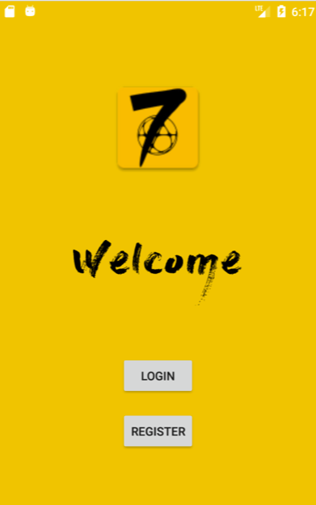
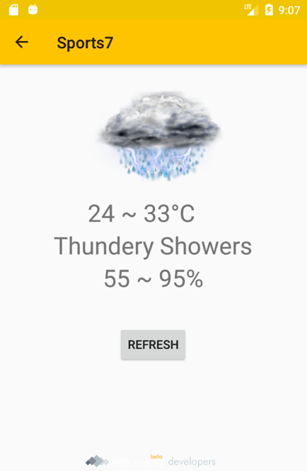
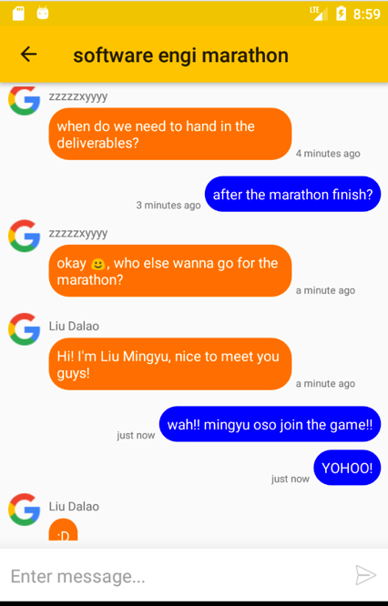
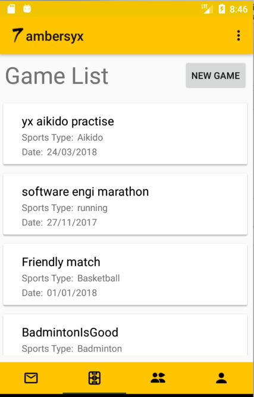

# Sports7 - Social Platform for sports lovers

CZ2006 Software Engineering, AY 2017-2018 Sem1 of NTU

## Description

People are having difficulty of finding enough players to play certain sports such as basketball and soccer. This gives rise to our mobile application which enables people with similar interest to play together. By using Sports7, a user can easily create a Game and this Game is visible to all the users. Other users who are interested can join the Game freely if it is set as public. The Game can also be set as private which will require a password to join. After playing games together, if they want to play together next time, they can add each other as friends and chat in private. Group chats can also be created for more people. Another feature of our app is that it provides the current weather information and remind them whether it is suitable to play outdoor sports. 

## Screen Shots

<!--      -->

## TODOs

1. Finish
 friends fragments

## Developed by Team7 on October, 2017.

    MMP""MM""YMM `7MM"""YMM        db      `7MMM.     ,MMF'
    P'   MM   `7   MM    `7       ;MM:       MMMb    dPMM
         MM        MM   d        ,V^MM.      M YM   ,M MM M******A'
         MM        MMmmMM       ,M  `MM      M  Mb  M' MM Y     A'
         MM        MM   Y  ,    AbmmmqMA     M  YM.P'  MM      A'
         MM        MM     ,M   A'     VML    M  `YM'   MM     A'
       .JMML.    .JMMmmmmMMM .AMA.   .AMMA..JML. `'  .JMML.  A'
                                                            A'
                                                           A'

- [@Geraldlim91](https://github.com/Geraldlim91)
- [@ambersyx](https://github.com/ambersyx)
- [@DarthAlpaca](https://github.com/DarthAlpaca)
- [@lyming90](https://github.com/lyming90)
- [@BoseSean](https://github.com/BoseSean)
- [@bboyhao](https://github.com/bboyhao)
- [@WilsonTan94](https://github.com/WilsonTan94)
